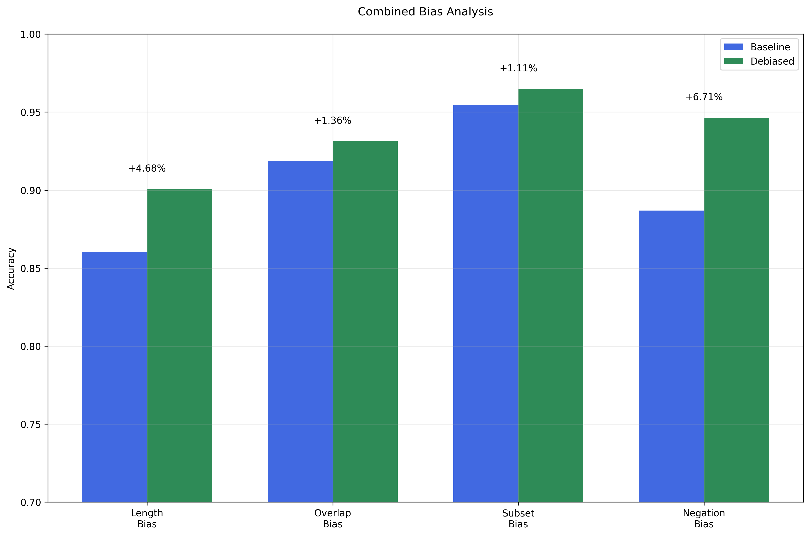
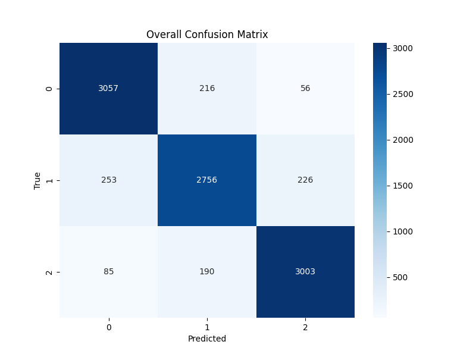

# NLI Dataset Artifact Analysis and Debiasing using multi-artifact attention 🔍

[](https://pytorch.org/)
[](https://www.python.org/)

## Overview 📊

This repository implements a novel multi-head debiasing architecture for Natural Language Inference (NLI) models, focusing on reducing dataset artifacts while maintaining high performance. Our approach combines:
- Contrastive learning
- Explicit bias prediction
- Temperature-scaled outputs
- Multi-artifact attention mechanism

## Key Features ⭐

- **Multi-Head Architecture**: Simultaneously addresses multiple types of artifacts
- **Artifact-Aware Attention**: Dynamically weighs different artifacts during inference
- **Advanced Loss Integration**: Combines task-specific and debiasing objectives
- **Comprehensive Analysis Framework**: Tools for quantifying and visualizing bias patterns

## Results 📈

<p align="center">
  
  <br>
  <em>Combined bias analysis per dataset artifact type</em>
</p>

<p align="center">
  
  <br>
  <em>Confusion matrix demonstrating improved prediction accuracy</em>
</p>

## Performance Highlights 🎯

```python
Bias Type Improvements:
- Length:    +4.68%
- Overlap:   +1.36%
- Subset:    +1.11%
- Negation:  +6.71%
```
## Examples of debiased model across artifact types 🔭
```
| Example | Premise                                                                                                                            | Hypothesis                                             | Gold Label | Baseline               | Debiased               |
|---------|------------------------------------------------------------------------------------------------------------------------------------|--------------------------------------------------------|------------|------------------------|------------------------|
| 1       | A large black dog and a small brown dog are playing in the house.                                                                  | The dogs are playing in the yard.                      | 2          | 0 (conf: 0.917)        | 2 (conf: 0.967)        |
| 2       | A young man in black pants and a gray shirt holds a skateboard with colorful decals upright while sitting on a gray stone block.   | The person is seated on a rock.                        | 0          | 2 (conf: 0.450)        | 0 (conf: 0.988)        |
| 3       | Three people are outside walking up a set of wooden stairs.                                                                        | Three people are walking outside down a set of stairs. | 2          | 0 (conf: 0.424)        | 2 (conf: 0.830)        |
| 4       | A football team getting ready for the coin toss in a half empty stadium.                                                           | The stadium is not full.                               | 0          | 2 (conf: 0.680)        | 0 (conf: 0.948)        |
```
